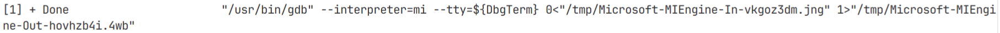

# GDB常用命令

## 源码搜索路径

### 将编译路径映射到实际的源码路径

- `set substitute-path <cpath> <spath>` 
  - `<cpath>` 编译时的源代码路径
  - `<spath>` 本机上的源代码路径
  - 举例：`set substitute-path /tmp/tmp/oneDNN-3.5.3/src/ /root/oneDNN-3.5.3/src`
  - 参见：动态库调试方法

## 执行控制

### 断点

`set breakpoint pending on`

- `b <exp>`
  - `<exp>` 格式
    - `int` 一个整数，表示断点在源代码中的行号
    - `+int` | `-int` 一个偏移量，表示断点相对于当前行号的偏移量
    - `str` 函数名
    - `path : str` 在源文件path中的函数名
- `d <num>` 删除断点，num可以从`info b`获得
- `info b` 显示所有的断点信息

### 执行

- `r` /  `run` 开始执行
- `s` / `step` 源代码单步执行，不步入语句
- `n` / `next` 汇编单步执行，不进入分支
- `si` 源代码步入执行
- `finish` 步出，完成当前函数
- `ni` 汇编步入执行
- `c` 继续执行到下一个断点或错误
- `j <num>` / `jump <num>` 跳转到第num行执行完毕之后
- `return <exp>` 强制函数返回表达式的值

## 内存控制

### 读内存

- `x /<num><format><width> <addr>`
  - `<num>`：一个整数，表示从地址addr开始要显示几个数据
  - `<format>`：`x|d|u|o|t|c` 显示格式，分别表 示hex、dec、unsigned dec、oct、bin、char
  - `<width>`：`b|h|w|g` 每个数据的字节长，分别表示byte、half word、word、dword
  - `<addr>`：`hex|<exp>` 起始地址，可以是一个地址或是一个表达式

## 寄存器控制

- 

## 信息显示

### 显示断点

- `info b`  `i b` 显示所有的断点信息
- `info r` `i r` 显示寄存器信息

### 删除断点

- `del <brk_num>`

### 显示源码

- `l` 继续显示上一次list的内容
- `l <exp>`
  - `<exp>`可以是行号/函数名

### 显示汇编

- `set disassemble-next-line on`

### 显示堆栈

- `bt` 显示当前函数调用栈
- `bt full`  显示当前函数调用栈

### 切换栈帧

- `frame <id>`

### 显示数据

- `print <exp>` `p <exp>` 打印寄存器

### 显示其他信息

- `info program` 显示程序执行状态

## 多线程

### 选中线程

- `thread <num>` 操作指定的线程，后续设置的断点就仅对当前线程生效
  - `<num>` : 一个线程的ID

## 系统

### 环境变量

- `set environment <key>=<value>` : 设置环境变量
  - 只会在程序执行前生效
  - 如果在VS Code里调试，只需在当前终端里用export的方式定义环境变量即可

### 产生信号量

- `signal`

## 界面

### 视图

- `layout asm` 显示汇编视图
- `layout regs` 显示寄存器视图
- `layout split` 分屏显示源码与汇编

## IDE调试原理

使用`--interpreter=mi`参数，进行输入输出重定向