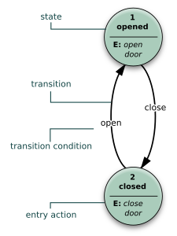

## 有限状态机FSM

> 表示有限个[状态](https://zh.wikipedia.org/wiki/状态)以及在这些状态之间的转移和动作等行为的[数学计算模型](https://zh.wikipedia.org/wiki/计算模型_(数学))。
>
> 
>
> （来自Wikipedia）

> 自动机是一个对信号序列进行判定的数学模型。
>
> 如果需要判定一个有限的信号序列和另外一个信号序列的关系（例如另一个信号序列是不是某个信号序列的子序列），那么常用的方法是针对那个有限的信号序列构建一个自动机。
>
> 自动机只是一个 **数学模型**，而 **不是算法**，也 **不是数据结构**。实现同一个自动机的方法有很多种，可能会有不一样的时空复杂度。
>
> 一个 **确定有限状态自动机（DFA）** 由以下五部分构成：
>
> 1. **字符集**（$\Sigma$），该自动机只能输入这些字符。
> 2. **状态集合**（$Q$）。如果把一个 DFA 看成一张有向图，那么 DFA 中的状态就相当于图上的顶点。
> 3. **起始状态**（$start$），$start \in Q$，是一个特殊的状态。起始状态一般用$s$表示，为了避免混淆，本文中使用$start$。
> 4. **接受状态集合**（$F$），$ F\subseteq Q $，是一组特殊的状态。
> 5. **转移函数**（$\delta$）， 是一个接受两个参数返回一个值的函数，其中第一个参数和返回值都是一个状态，第二个参数是字符集中的一个字符。如果把一个 DFA 看成一张有向图，那么 DFA 中的转移函数就相当于顶点间的边，而每条边上都有一个字符。
>
> DFA 的作用就是识别字符串，一个自动机 ，若它能识别（接受）字符串 ，那么 ，否则 。
>
> 当一个 DFA 读入一个字符串时，从初始状态起按照转移函数一个一个字符地转移。如果读入完一个字符串的所有字符后位于一个接受状态，那么我们称这个 DFA **接受** 这个字符串，反之我们称这个 DFA **不接受** 这个字符串。
>
> （来自OI Wiki）

几种动作：

- 进入动作
- 退出动作
- 输入动作
- 转移动作

### Moore型

### Mealy型