本文档由 AI 总结，可能有错误。

这篇文章研究的是：传统超标量处理器虽然每个周期能同时处理多条指令，但真实程序里经常找不到足够多彼此独立的指令，所以很多硬件能力用不满。作者要解决的是，能不能把多线程程序里不同线程的并行性拿来“喂饱”同一颗超标量处理器，让它在更多周期里真正并行工作。论文提出了一种多上下文多线程超标量处理器 MCMS，在常规超标量处理器上增加多个硬件上下文、线程同步支持和上下文切换机制，使多个线程的指令能并发进入流水线，再通过仿真评估这种设计能否提高指令级并行性和整体性能。

## 论文信息

- 标题：Multiple context multithreaded superscalar processor architecture
- 作者：K.S. Loh, W.F. Wong
- 单位：Department of Computer Science, School of Computing, National University of Singapore
- 期刊：Journal of Systems Architecture 46 (2000) 243–258

## 摘要

超标量体系结构正在成为当今高性能微处理器设计中的常态。然而，程序中能够达到的指令级并行性限制了这类体系结构的可扩展性。本文提出了一种多上下文多线程超标量处理器（Multiple Context Multithreaded Superscalar Processor，MCMS），它是在传统超标量处理器体系结构基础上，为支持多线程而进行的扩展。其动机来自多线程程序中存在的大量潜在指令级并行性。文中还提出了一种多线程结构的硬件实现方式。基于指令轨迹驱动的仿真结果表明，MCMS 的确能够显著提升指令级并行性。一个拥有四个硬件上下文的 MCMS 处理器，在与资源规模相近的超标量处理器相比时，最高可获得 2.5 倍加速。我们发现，主要限制因素会从超标量处理器中的数据相关，转移为 MCMS 中的资源争用。

**关键词：** 超标量处理器；多线程；多上下文；仿真；指令级并行性

## 1 引言

随着半导体技术的进步，我们能够在一颗处理器中集成越来越多的晶体管。这使得在硬件中实现更复杂的技术成为可能，例如多发射、乱序发射、推测执行和寄存器重命名。此外，多个执行单元以及更大的片上缓存也成为现实。

当前大多数高性能微处理器都采用了上述超标量（Superscalar，SS）技术。超标量体系结构使多条指令能够在一个周期内被同时取指、译码并执行。简单来说，它加宽了处理器的执行流水线。更宽的流水线可以提高指令吞吐量。然而，我们必须从程序中提取出足够多的指令级并行性，才能充分利用这条更宽的执行流水线。

研究者已经探索了多种提高指令级并行性的方法，其中既有硬件技术，也有软件技术。硬件技术包括推测执行、寄存器重命名和带前瞻能力的乱序发射。软件技术通常被集成到编译器中作为优化手段。程序中的指令通常会被重新排列，希望借此提高指令级并行性。常见的方法包括轨迹调度（trace scheduling）、循环展开（loop unrolling）、软件流水（software pipelining）、最优寄存器分配算法以及静态分支预测。

本文将研究这样一种可能性：利用多线程技术来提升指令级并行性，从而更好地利用超标量处理器的资源。作为一种编程范式，多线程编程如今几乎已经被所有现代操作系统在内核层面支持。一个多线程应用中，不同执行线程的指令在很大程度上彼此独立。如果允许来自多个线程的指令并发执行，就可以利用这种独立性来提高指令级并行性。要做到这一点，处理器就必须支持多个上下文。基于这一动机，我们提出了多上下文多线程超标量（MCMS）处理器体系结构。同时，文中还提出了一种硬件机制，用于高效执行多线程结构。

第 2 节将介绍当前在处理器级硬件支持多线程方面的一些已有工作，为本文奠定背景。第 3 节将介绍 MCMS 体系结构的设计与一些实现细节。第 4 节将简要描述本研究所使用的仿真技术。第 5 节给出仿真结果及相关讨论。最后，第 6 节给出结论并总结本文的发现。

## 2 处理器级的多线程

多线程之所以会在多处理器系统中得到实现，主要出于两个原因。第一，它为程序员提供了一种可以直接在共享内存多处理器上工作的“轻量级”机制。第二，它可以用来隐藏诸如远程内存访问之类的长延迟操作。此类延迟范围通常在数十到数百个处理器周期之间。常见的两种调度方法是阻塞式（blocked）和交错式（interleaved）两种方案。在阻塞式方案中，当线程遇到一次长延迟操作时就会发生上下文切换。交错式方案则按周期在不同上下文之间切换，每个上下文轮流发射指令。APRIL、HEP、MASA 和 TERA 都是这类实现的例子。

阻塞式方案无助于减少流水线停顿，因为它并没有利用来自多个线程的并行性。交错式方案虽然可以利用这种并行性，但必须有足够多的线程才能充分利用流水线。大多数实现都采用严格交错（strict interleaving）方案，即使某个线程当前没有可发射的指令，也不能跳过它。通常，这些多处理器会用内存标签（memory tags）来实现线程同步。

Hirata 等人提出过一种多线程体系结构，用于提升并行指令发射能力。每个线程拥有自己的指令译码器和指令队列，每个线程在每个周期最多可发射 1 条指令。在一个高度并行的光线追踪程序上进行仿真时，采用 4 线程和 8 线程的处理器，相较单线程处理器分别获得了 3.72 倍和 5.79 倍加速。该工作假设所有缓存访问都命中，因此没有考虑线程之间在缓存上的抖动（inter-thread cache thrashing）。

同时多线程（Simultaneous Multithreading，SMT）被提出，用于最大化超标量处理器中的指令发射槽利用率。它利用多个独立执行线程所带来的指令级并行性，力图最小化发射槽的纵向浪费和横向浪费，方法是在同一个周期内允许来自多个线程的指令同时发射。Tullsen 等人在文献中表明，不必为传统超标量处理器增加过多复杂度，就可以实现同时多线程。我们在 MCMS 中吸收了他们的一些方法，但 MCMS 与 SMT 在实现细节上，尤其是在同步机制方面，并不相同。

Lo 等人的研究也报告了与 SMT 大体相近的加速效果。他们使用的处理器配置拥有大量资源：一个 4 端口数据缓存、4 个 ALU 单元和 4 个浮点单元。由于采用了这些假设，他们没有识别出资源争用的出现。Tullsen 等人则发现，SMT 的限制因素是取指吞吐率。

Hily 和 Seznec 研究了 SMT 中二级缓存的争用问题。他们证明，如果忽略二级缓存争用，可能会高估 SMT 的性能。他们还表明，内存约束可能会限制线程数量。而且，他们的仿真假设了完美分支预测以及无限数量的单周期功能单元。

另一项类似工作是 Gulati 和 Bagherzadeh 对多线程超标量处理器所做的性能研究。他们模拟了一种资源受限的处理器配置，并在多种基准上报告了 20% 到 55% 的加速。其数据缓存只有 8KB 且为单端口。此外，在他们的设计中，大小为 128 的寄存器文件由所有执行线程共享，因此资源争用和存储需求可能会严重限制性能收益。

这些工作大多没有真正给出线程同步机制的实现，尽管它们都提到高效同步是可能的。与此同时，它们使用的软件线程数通常总是小于或等于处理器体系结构所支持的上下文数。但在现实中，软件线程的数量可能会增长到超过硬件上下文的数量。

SMT 和 Gulati 的模拟研究都会使用不同数量的软件线程来测试并发执行线程数变化带来的影响。我们认为，这种比较并不十分公平。即使采用相同的程序和相同的数据集，由于任务的划分方式不同，程序行为仍会不同。例如，一个程序如果被划分为两个线程，其内存需求必然与将同一个程序划分为四个或八个线程时不同。我们希望通过本文工作来解决这些以及其他问题。

## 3 MCMS 体系结构

我们以一种通用的传统超标量处理器体系结构作为 MCMS 的基础，并在其上做扩展，以提供对多个上下文和多线程的支持。我们希望尽可能只做最小化扩展，以在可能的情况下减少新增复杂度。图 1 展示了 MCMS 体系结构的组织方式。

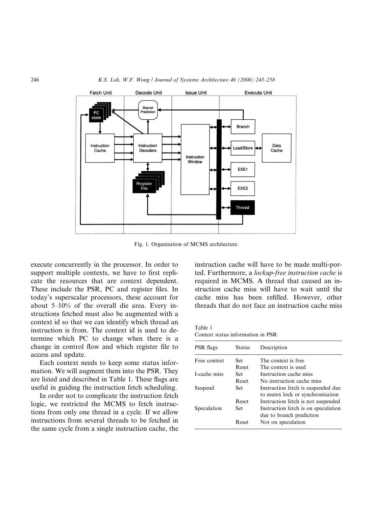

### 3.1 多上下文

为了允许不同线程的指令在处理器中并存并同时执行，必须支持多个上下文。为了实现这一点，首先必须复制那些与上下文相关的资源，包括 PSR、PC 和寄存器文件。在今天的超标量处理器中，这些资源约占总芯片面积的 5% 到 10%。此外，每条取出的指令都必须增加一个上下文 ID，以便我们能够识别它属于哪个线程。上下文 ID 用于决定：当控制流发生变化时，应该修改哪一个 PC；以及应访问和更新哪一个寄存器文件。

每个上下文都需要保存一些状态信息。我们将这些状态信息附加到 PSR 中，具体如表 1 所列。这些标志对取指调度具有指导作用。

- **Free context**：若置位，表示该上下文空闲；若清零，表示该上下文正在使用。
- **I-cache miss**：若置位，表示发生指令缓存缺失；若清零，表示无指令缓存缺失。
- **Suspend**：若置位，表示因互斥锁或同步而暂停取指；若清零，表示取指未暂停。
- **Speculation**：若置位，表示由于分支预测而处于推测取指状态；若清零，表示不处于推测状态。

为了不让取指逻辑变得过于复杂，我们在 MCMS 中限制每个周期只从一个线程取指。如果允许在同一个周期从多个线程、通过单一指令缓存来同时取指，则该指令缓存必须做成多端口。此外，MCMS 还需要无锁死（lockup-free）的指令缓存。如果某个线程引发了指令缓存缺失，它就必须等待，直到该缓存缺失被填充完成。然而，其他没有遇到指令缓存缺失的线程，应当仍然能够继续从指令缓存中取指。无锁死指令缓存意味着：一个线程的 I-cache miss 不会拖延另一个线程的取指。

与仅有一个 PC 的超标量处理器不同，MCMS 拥有多个 PC。因此，我们需要一种调度机制，在每个周期选择从哪个线程取指。我们利用上下文状态来辅助调度。只有那些已经被占用的上下文才会被纳入选择范围，而 I-cache miss 标志或 suspend 标志被置位的上下文不能被选中。调度器首先尝试寻找一个表 1 中所有标志都为清零状态的上下文。如果候选上下文不止一个，则通过轮转（round robin）方式进行选择，以便混合不同线程的指令。如果没有任何上下文满足所有标志清零，则选择仅 speculation 标志被置位的上下文。同样地，当存在多个候选时，也采用轮转方法。

译码单元负责执行指令译码、寄存器重命名以及结果提交。其译码宽度与取指单元宽度相同，因此一个周期中取出的所有指令都能在一个周期内完成译码。我们使用重排序缓冲区（reorder buffer）作为寄存器重命名机制。由于存在多个寄存器文件，因此也使用多个重排序缓冲区，每个寄存器文件配一个。分支历史缓冲区采用 2 位历史信息来执行分支预测。所有执行线程共享这个分支历史缓冲区。

这些执行线程也共享指令窗口和执行单元。译码后的指令将被放入指令窗口。指令窗口可以像 UltraSparc 那样由单一指令缓冲区组成，也可以像 MIPS R10000 那样由多个指令队列组成。来自不同线程的指令会交错地放入共享缓冲区或队列中。指令发射时只需要考虑数据相关性。特别地，上下文 ID 不参与指令发射决策。换句话说，不同线程的指令可以在同一个周期内同时发射。上下文 ID 仅用于确定要访问哪个寄存器文件或哪个重排序缓冲区。

数据缓存同样由所有执行线程共享。假定这些多线程应用运行在同一个内存地址空间中。如果为每个上下文各使用一个数据缓存，就必须引入某种缓存一致性控制，这会增加复杂度。因此，我们选择使用单一共享数据缓存。

### 3.2 多线程结构的硬件实现

我们识别出了五种基础的多线程原语，并假设这些原语已经被加入 MCMS 的指令集体系结构之中。`thread create` 会增加执行线程数量，而 `thread terminate` 会减少执行线程数量。`mutex lock` 与 `mutex unlock` 可用于创建临界区，从而保证对共享内存的原子修改。`barrier synchronisation` 则是线程交换信息的同步点。

为执行这些指令，MCMS 体系结构中加入了一个线程单元（thread unit）。它使用三张表来保存互斥锁与屏障同步的状态：lock table、sync table 与 wait-for table。lock table 和 sync table 分别保存互斥锁与屏障同步的状态，其条目数对应于硬件所支持的 mutex lock 和 barrier 的数量。wait-for table 则记录某个上下文当前正在等待的锁或屏障。每个上下文分配一个条目即可，因为一个上下文在同一时刻最多只会等待一个 mutex lock 或一个 barrier。表 2 中给出了这些表的字段：

- **Lock 表**：`Lock/unlock`，若置位表示该锁已被使用，若清零则表示未被使用。
- **Sync 表**：`Max` 表示将在该 barrier 处同步的线程数量；`Remaining` 表示还有多少线程尚未到达该 barrier。
- **Wait-for 表**：`Lock/sync` 表示等待的是锁还是屏障；`Lock id/sync id` 表示该线程正在等待的锁 ID 或同步 ID。

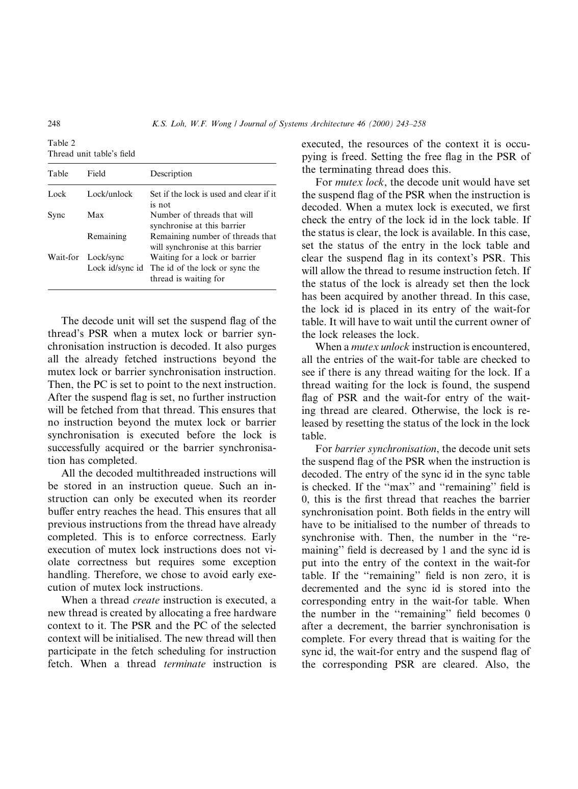

当译码单元译码到 `mutex lock` 或 `barrier synchronisation` 指令时，会设置该线程 PSR 中的 suspend 标志。同时，它还会清除在这条 `mutex lock` 或 `barrier synchronisation` 指令之后已经取出的所有指令。然后，把 PC 设置为指向下一条指令。一旦 suspend 标志被设置，就不会再从该线程继续取出指令。这保证了：在成功获取锁或屏障同步完成之前，不会有位于这两类指令之后的任何指令被执行。

所有已译码的多线程指令都将被存放到一个指令队列中。此类指令只有当其重排序缓冲区条目到达队首时才会被执行。这保证了该线程之前的所有指令都已经完成，从而确保正确性。虽然提前执行 `mutex lock` 指令并不会破坏正确性，但那样需要额外的异常处理。因此，我们选择避免提早执行 `mutex lock`。

当执行 `thread create` 指令时，会通过分配一个空闲的硬件上下文来创建新线程。被选中上下文的 PSR 和 PC 将被初始化，然后该新线程会参与取指调度。当执行 `thread terminate` 指令时，它所占用上下文的资源会被释放。实现方式是设置其 PSR 中的 free 标志。

对于 `mutex lock`，译码单元在译码该指令时就已经设置了 PSR 的 suspend 标志。当执行一条 `mutex lock` 指令时，首先检查 lock table 中对应 lock id 的条目。如果该条目的状态是清零的，说明该锁当前可用。这种情况下，将 lock table 中相应条目置位，并清除该上下文 PSR 中的 suspend 标志，这样线程就可以继续取指。如果该锁的状态已经被置位，说明这把锁已经被另一个线程持有。此时，将该 lock id 记录到该上下文在 wait-for table 中的条目中。它必须等待，直到当前持锁线程释放该锁。

当遇到 `mutex unlock` 指令时，会检查 wait-for table 的所有条目，看看是否有线程正在等待这把锁。如果找到等待该锁的线程，就清除其 PSR 中的 suspend 标志，并清空 wait-for table 中对应条目。否则，就通过清除 lock table 中对应条目的状态来释放这把锁。

对于 `barrier synchronisation`，译码单元在译码该指令时设置 PSR 的 suspend 标志。随后检查 sync table 中对应 sync id 的条目。如果其 `max` 和 `remaining` 字段都为 0，说明这是第一个到达该 barrier 的线程。这时，这两个字段都要初始化为需要在此同步的线程数量。然后，将 `remaining` 字段减 1，并把 sync id 写入该上下文在 wait-for table 中的条目中。如果 `remaining` 字段原本非 0，则同样将其减 1，并把 sync id 存入对应的 wait-for table 条目。当一次减 1 之后，`remaining` 变成 0，则表示这次 barrier 同步完成。对于所有等待该 sync id 的线程，都要清除其 wait-for 条目和 PSR 中的 suspend 标志。同时，每恢复一个线程，就将 `max` 字段减 1。

### 3.3 上下文切换

当执行线程数超过可用硬件上下文数时，就需要进行上下文切换。由于硬件上下文数量限制了同一时刻可并发执行的线程数，额外的线程就必须被换出处理器。上下文切换的含义是：用另一个线程替换某个上下文中当前所占用的线程。

我们需要一些标准来决定线程何时应被换出。本文选择了两个条件：第一，当线程获取互斥锁失败时；第二，当线程正在等待 barrier 同步完成时。选择这两个条件的原因是：在这两种情况下，无需清除任何额外指令。因为此前的所有指令都已经完成，而后续指令尚未被取出。同时，该线程本身也无法继续执行。

当发生上下文切换时，我们必须保存被换出线程的状态，并恢复被换入线程的状态。需要保存和恢复的状态包括 PSR、PC、寄存器文件以及它在 wait-for table 中的条目。为减少保存和恢复上下文状态的开销，我们在 PSR 中又增加了一个标志位，即 `swap-out` 标志。当一个线程将要被换出时，该标志会被置位。凡是 `swap-out` 标志已经置位的上下文，只要其上下文被其他线程需要，就可以被换出。否则，它仍然可以继续占据该上下文。如果一个线程在真正被换出之前就已经可以恢复执行，那么就无需保存和恢复其状态。

如果在线程创建时没有空闲上下文，那么新创建的线程必须被换出。当某个线程终止时，会有一个上下文被释放。一旦上下文变为空闲，就可以换入某个正在等待恢复执行的线程。为了找到能够恢复执行的线程，我们首先会恢复并检查那些已被换出线程的 wait-for 条目。如果找到能够恢复执行的线程，就恢复其完整状态，并继续执行。

当一个线程满足换出条件时，就将其 `swap-out` 标志置位。如果此时正好存在等待换入的线程，就会发生一次上下文切换；否则，该线程仍然继续占据该上下文。在一次 `mutex unlock` 或 barrier 同步完成之后，如果存在空闲上下文，那么一个或多个被换出的线程就可能被允许继续执行。

## 4 仿真技术

我们将使用仿真来量化 MCMS 体系结构的性能。仿真的好处在于：它能灵活地重新配置处理器参数，并允许详细收集统计信息。我们扩展了 SPATS 模拟器，使其能够模拟 MCMS 体系结构。SPATS 是一个针对超标量处理器的精确而灵活的、基于指令轨迹驱动的逐周期指令级模拟器。我们所做的扩展包括两方面：一是为多线程应用生成指令轨迹，二是模拟 MCMS 的行为。

指令轨迹（instruction trace）是指应用在执行时所有已执行指令的序列。我们使用 Digital Unix 上的插桩工具 ATOM 来提取指令轨迹。对于顺序程序，我们得到的是一条单一指令序列；对于多线程应用，我们会为每个执行线程分别生成一条指令轨迹。拥有多条指令轨迹后，各线程在仿真时就可以按自己的节奏推进，唯一的例外是必须满足同步约束。我们还编写了一个简单的用户级多线程库 Uthread，用于配合 ATOM 提取多线程应用的指令轨迹。

我们的仿真工作负载采用 Splash 与 Splash 2 中的基准程序，这些都是可以写成多线程形式的共享内存并行应用。程序使用 Digital C 编译器，并开启 `-O5` 与 `-fast` 优化选项进行编译。每个程序都准备两个版本：顺序版和多线程版。顺序版不使用任何多线程设施，以单线程程序方式执行；多线程版则使用 Uthread 库来替代系统原有的多线程库，这样 ATOM 才能生成指令轨迹。

为了比较 MCMS 与超标量体系结构的性能，我们首先模拟一个超标量处理器。其配置简称为 SS。我们调研了当时已有的超标量处理器，以确定一个具有现实意义的处理器配置。表 3 展示了所模拟配置与 MIPS R10000、Ultra Sparc I 以及 Alpha 21164 的对比；表 4 则给出了指令执行延迟的对比。

缓存配置和缓存访问延迟列于表 5。缓存补入采用最近最少使用（LRU）替换策略。指令缓存与数据缓存中都包含一个 64 项的 TLB。TLB miss 的惩罚设为 30 个周期，二级缓存 miss 的惩罚设为 25 个周期。整数与浮点指令队列都允许乱序分发；内存队列则只允许顺序分发。此外，store 指令只有在其之前所有指令都已完成时，才允许更新数据缓存。在 SS 的仿真中，我们使用顺序版工作负载。

对于 MCMS 体系结构，我们使用了四种不同配置。它们分别支持不同数量的硬件上下文：h1 配置支持 1 个硬件上下文，h2、h4 与 h8 配置分别支持 2、4、8 个硬件上下文。这决定了同一时刻最多可以有多少线程在处理器中并发执行。这些配置所拥有的硬件资源与 SS 配置相同，只是额外增加了一个线程单元和多个上下文。因此，MCMS 相比 SS 的唯一资源优势，就是额外的寄存器文件和重排序缓冲区。

MCMS 配置的仿真使用多线程版工作负载，而不是顺序版工作负载。在所有 MCMS 配置中，工作负载都被设定为运行 8 个软件线程。这样一来，不同 MCMS 配置（h1、h2、h4、h8）所使用的工作负载就完全一致。在 h8 中，由于 8 个线程都可以被硬件上下文容纳，因此不需要上下文切换；而在 h1、h2 和 h4 中，由于任意时刻最多只能分别容纳 1、2、4 个线程，因此都需要上下文切换。我们面临的一个困难是如何计入上下文切换开销。我们最终选择不计入这部分开销，因为我们认为其高度依赖具体实现；而在此前也几乎没有足够多的实现可供参考，因此很难给出一个现实的近似值。

## 5 仿真结果

我们首先在超标量处理器（SS 配置）上运行顺序版工作负载。这样做是为了识别顺序程序中指令级并行性的限制来源。之后，再使用多线程版工作负载对 MCMS 配置进行仿真。本研究中线程数量固定为 8。我们随后对结果进行了分析，以识别性能提升的来源及可能的瓶颈。

### 5.1 顺序程序中的指令级并行性受限

我们对超标量处理器（SS 配置）的仿真结果表明，每周期指令数（ipc）介于 0.71 到 0.97 之间。相对于该模拟处理器配置理论上的 4 ipc 峰值性能，这还不到四分之一。超标量处理器的限制因素大致可分为三类：数据相关、控制相关和资源冲突。

图 2 展示了在指令队列中存在 0、1、2、3 以及 4 条或更多条 ready instruction 的周期分布情况。所谓 ready instruction，是指其源操作数值均已就绪、可被分发执行的指令。由于资源争用，并不是所有 ready instruction 都能在同一个周期内发射。图中还给出了每个周期中发射 0、1、2、3 以及 4 条或更多条指令的分布比例。

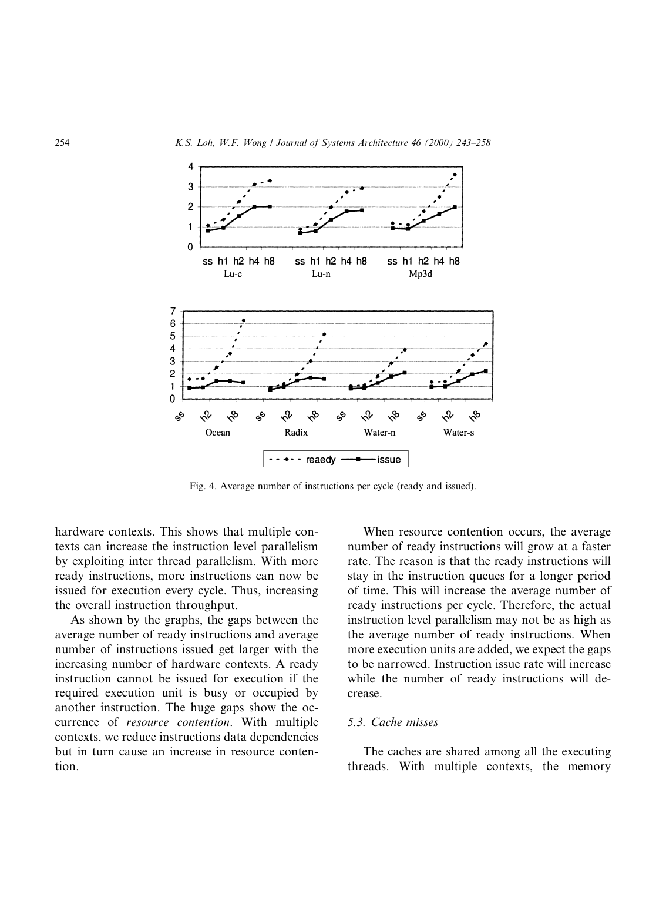

指令队列在总执行时间中只有不到 3% 的时间是空的，而在超过 70% 的总执行时间中，队列里都存在超过 4 条指令。因此，队列并不存在“无指令可取”的情况。这里的统计并不包括因错误分支预测而被取出的那些指令。由于控制相关会导致指令饥饿，因此我们可以说，控制相关并不是一个严重的限制因素。

从图 2 可见，在总执行时间的 37% 到 51% 内，队列中根本没有 ready instruction。当没有 ready instruction 时，就没有任何指令能够发射执行。这是限制指令吞吐率的主要因素。问题的根源在于数据相关。指令队列中的大多数指令都在等待其源操作数值到来。这表明，程序中并不存在足够多的指令级并行性，来充分利用超标量处理器加宽后的流水线。由于 ready instruction 的数量较少，因此资源争用在这里并不严重。

### 5.2 MCMS 的性能

图 3 给出了 MCMS（h1、h2、h4、h8 配置）相对于超标量处理器（SS 配置）的加速比。结果表明，单硬件上下文配置 h1 相对 SS 并没有显著加速。最明显的原因是：这两种配置在任意时刻都只允许一个线程执行，因此 h1 无法利用线程间的指令级并行性。图中清楚显示：当使用 2 个和 4 个硬件上下文（h2 与 h4）时，加速比有明显提升，约为 1.3 到 2.5 倍。而当增加到 8 个硬件上下文时，速度提升则不再那么显著。在 ocean 和 radix 的情况下，h8 的性能甚至低于 h4。ocean 遇到了大量缓存缺失，其性能受内存需求限制；而 radix 则在上下文数增加后，出现了大量 TLB miss。

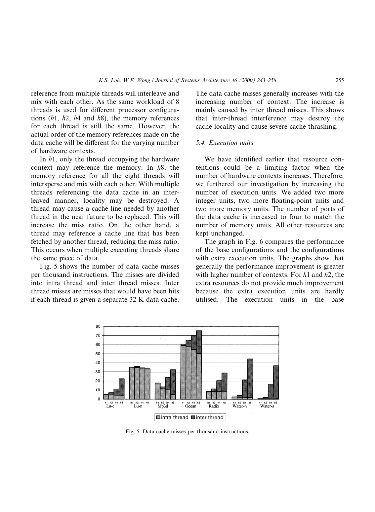

图 4 给出了在不同硬件上下文数量下，各程序平均每周期 ready instruction 数量以及平均每周期发射指令数。从图中可以看出，平均 ready instruction 数会随着硬件上下文数量增加而增加。这表明：通过多个上下文，可以利用线程间并行性来提升指令级并行性。ready instruction 增加后，每个周期就能发射更多指令，从而提高整体指令吞吐率。

图中还可看到，随着硬件上下文数的增加，平均 ready instruction 数与平均发射指令数之间的差距也在变大。一条 ready instruction 如果所需执行单元正忙，或者该执行单元已被其他指令占用，就无法被发射执行。这个巨大差距说明资源争用已经出现。在拥有多个上下文后，我们降低了指令间数据相关的限制，但转而带来了资源争用的增加。

当发生资源争用时，平均 ready instruction 数的增长速度会更快。原因在于：这些 ready instruction 会在指令队列中停留更久，从而提高平均每周期 ready instruction 数。因此，实际的指令级并行性未必真有平均 ready instruction 数看起来那么高。如果再增加更多执行单元，我们预计这种差距会缩小：发射率会上升，而 ready instruction 数会下降。

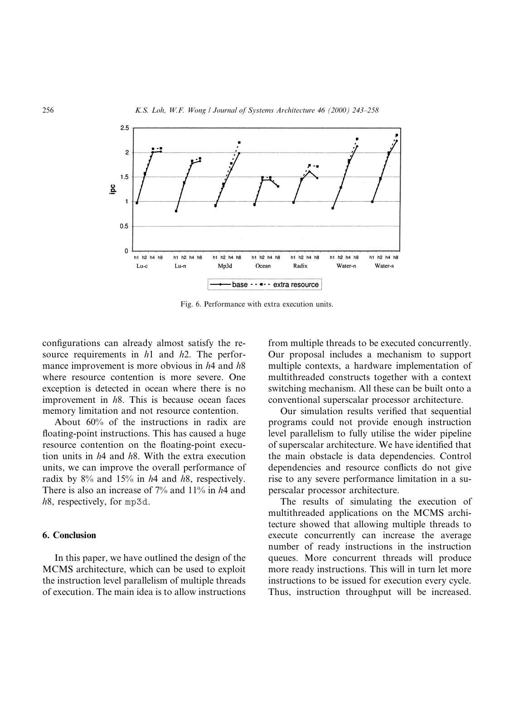

### 5.3 缓存缺失

缓存由所有执行线程共享。随着上下文数量增加，来自多个线程的内存访问会相互交错、相互混合。由于不同处理器配置（h1、h2、h4、h8）使用的是同一个 8 线程工作负载，因此每个线程本身的内存访问序列并没有改变；但这些访问在共享数据缓存中实际发生的顺序，会随着硬件上下文数量的不同而发生变化。

在 h1 中，只有占据当前硬件上下文的线程能访问内存。在 h8 中，八个线程的内存访问会完全交织混合。多个线程以交错方式访问数据缓存时，局部性可能被破坏。例如，一个线程可能会把另一个线程在不久之后就需要用到的缓存行替换掉，从而增加缺失率。另一方面，如果多个正在执行的线程恰好共享同一份数据，那么一个线程也可能命中另一个线程已经取入的缓存行，从而降低缺失率。

图 5 展示了每千条指令的数据缓存缺失数。缺失又被分为线程内缺失（intra-thread misses）和线程间缺失（inter-thread misses）两类。所谓线程间缺失，是指：如果给每个线程分配一个独立的 32KB 数据缓存，那么这些缺失本来会变成命中。

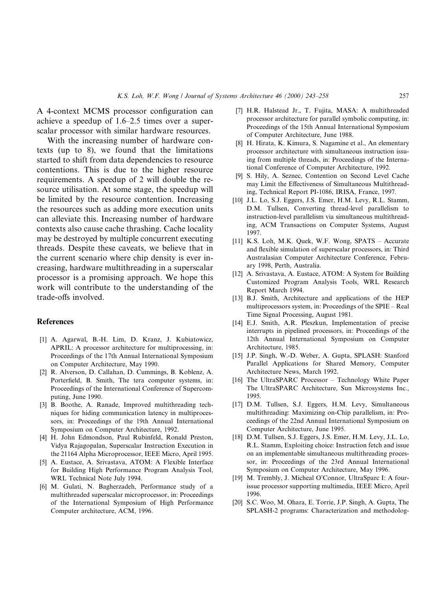

结果表明，数据缓存缺失通常会随着上下文数增加而增加，而这种增长主要是由线程间缺失造成的。这说明线程间干扰会破坏缓存局部性，并可能造成严重的缓存抖动（cache thrashing）。

### 5.4 执行单元

前文已经指出，当硬件上下文数量增加时，资源争用可能成为限制因素。因此，我们进一步做了实验：增加执行单元数量。具体地，我们增加了两个整数单元、两个浮点单元以及两个内存单元。与此同时，把数据缓存的端口数增加到 4，以匹配 4 个内存单元。其他资源则保持不变。

图 6 对比了基础配置与增加额外执行单元后的配置性能。图中表明，通常情况下，硬件上下文越多，增加执行单元所带来的性能提升越明显。对于 h1 和 h2 来说，增加资源并没有带来太多改进，因为这些额外执行单元几乎没有被充分利用。基础配置中的执行单元已经大致可以满足 h1 和 h2 的资源需求。而在 h4 和 h8 中，由于资源争用更严重，因此性能提升更为明显。一个例外是 ocean：在 h8 中，即便增加执行单元也没有提升，因为 ocean 面临的限制是内存，而非执行资源争用。

在 radix 中，大约 60% 的指令都是浮点指令。这导致 h4 和 h8 中浮点执行单元的资源争用非常严重。在增加额外执行单元后，radix 在 h4 和 h8 中的总体性能分别提高了 8% 和 15%。对于 mp3d，在 h4 和 h8 中也分别提升了 7% 和 11%。

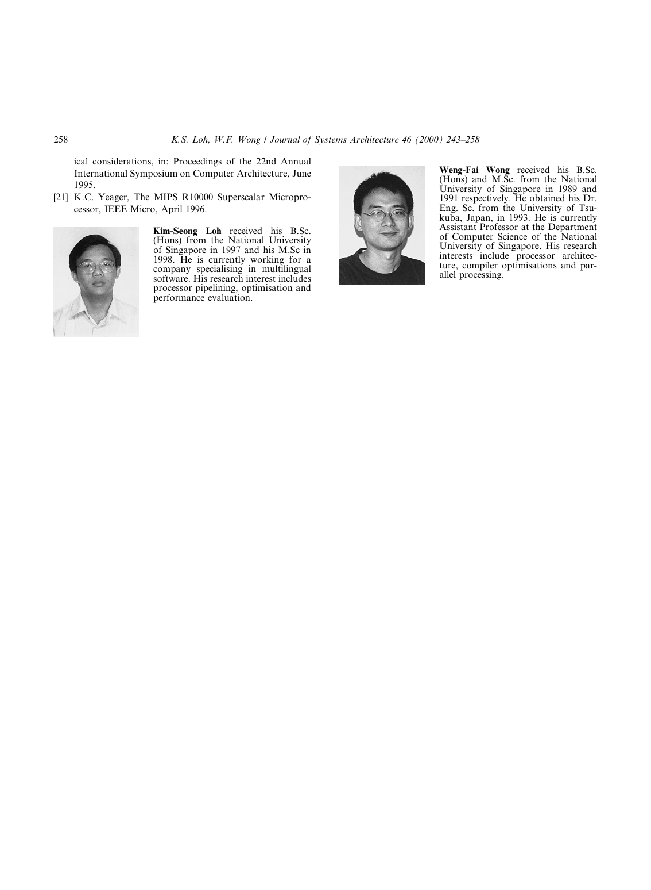

## 6 结论

本文概述了 MCMS 体系结构的设计。它可以用来挖掘多个执行线程中的指令级并行性。其核心思想是：允许来自多个线程的指令在同一个处理器中并发执行。我们的方案包括：支持多个上下文的机制、多线程原语的硬件实现，以及一个上下文切换机制。所有这些都可以建立在传统超标量处理器体系结构之上。

我们的仿真结果验证了：顺序程序无法提供足够的指令级并行性，来充分利用超标量体系结构的宽流水线。我们识别出，主要障碍是数据相关。而在超标量处理器体系结构中，控制相关和资源冲突并不会带来特别严重的性能限制。

对多线程应用在 MCMS 上执行的仿真结果显示，允许多个线程并发执行，能够提高指令队列中平均 ready instruction 的数量。并发线程越多，ready instruction 越多。这反过来又允许每个周期有更多指令被发射执行，从而提高指令吞吐率。一个四上下文的 MCMS 处理器配置，在与硬件资源相近的超标量处理器相比时，可实现 1.6 到 2.5 倍加速。

随着硬件上下文数量增加（最高到 8），我们发现限制因素开始从数据相关转移到资源争用。这是因为资源需求变得更高。若系统获得 2 倍加速，资源利用率也会相应翻倍。在某个阶段之后，加速收益将受到资源争用的限制。增加资源（例如加入更多执行单元）可以缓解这一问题。同时，硬件上下文数增加也会带来缓存抖动，多个并发执行线程可能破坏缓存局部性。尽管存在这些问题，我们仍然认为，在当前芯片集成度不断提升的背景下，在超标量处理器中引入硬件多线程是一种很有前景的方法。我们希望这项工作有助于理解其中涉及的各种权衡。

## 参考文献

以下保留原文参考文献条目：

1. A. Agarwal, B.-H. Lim, D. Kranz, J. Kubiatowicz, APRIL: A processor architecture for multiprocessing, Proceedings of the 17th Annual International Symposium on Computer Architecture, 1990.
2. R. Alverson, D. Callahan, D. Cummings, B. Koblenz, A. Porterfield, B. Smith, The tera computer systems, Proceedings of the International Conference of Supercomputing, 1990.
3. B. Boothe, A. Ranade, Improved multithreading techniques for hiding communication latency in multiprocessors, Proceedings of the 19th Annual International Symposium on Computer Architecture, 1992.
4. H. John Edmondson, Paul Rubinfeld, Ronald Preston, Vidya Rajagopalan, Superscalar Instruction Execution in the 21164 Alpha Microprocessor, IEEE Micro, 1995.
5. A. Eustace, A. Srivastava, ATOM: A Flexible Interface for Building High Performance Program Analysis Tool, 1994.
6. M. Gulati, N. Bagherzadeh, Performance study of a multithreaded superscalar microprocessor, ACM, 1996.
7. H.R. Halstead Jr., T. Fujita, MASA: A multithreaded processor architecture for parallel symbolic computing, 1988.
8. H. Hirata, K. Kimura, S. Nagamine et al., An elementary processor architecture with simultaneous instruction issuing from multiple threads, 1992.
9. S. Hily, A. Seznec, Contention on Second Level Cache may Limit the Effectiveness of Simultaneous Multithreading, 1997.
10. J.L. Lo, S.J. Eggers, J.S. Emer, H.M. Levy, R.L. Stamm, D.M. Tullsen, Converting thread-level parallelism to instruction-level parallelism via simultaneous multithreading, ACM Transactions on Computer Systems, 1997.
11. K.S. Loh, M.K. Quek, W.F. Wong, SPATS – Accurate and flexible simulation of superscalar processors, 1998.
12. A. Srivastava, A. Eustace, ATOM: A System for Building Customized Program Analysis Tools, 1994.
13. B.J. Smith, Architecture and applications of the HEP multiprocessors system, 1981.
14. E.J. Smith, A.R. Pleszkun, Implementation of precise interrupts in pipelined processors, 1985.
15. J.P. Singh, W.-D. Weber, A. Gupta, SPLASH: Stanford Parallel Applications for Shared Memory, 1992.
16. The UltraSPARC Processor – Technology White Paper The UltraSPARC Architecture, Sun Microsystems Inc., 1995.
17. D.M. Tullsen, S.J. Eggers, H.M. Levy, Simultaneous multithreading: Maximizing on-Chip parallelism, 1995.
18. D.M. Tullsen, S.J. Eggers, J.S. Emer, H.M. Levy, J.L. Lo, R.L. Stamm, Exploiting choice: Instruction fetch and issue on an implementable simultaneous multithreading processor, 1996.
19. M. Trembly, J. Micheal O'Connor, UltraSparc I: A four-issue processor supporting multimedia, IEEE Micro, 1996.
20. S.C. Woo, M. Ohara, E. Torrie, J.P. Singh, A. Gupta, The SPLASH-2 programs: Characterization and methodological considerations, 1995.
21. K.C. Yeager, The MIPS R10000 Superscalar Microprocessor, IEEE Micro, 1996.

## 附：含图表的论文原页（兜底保留）

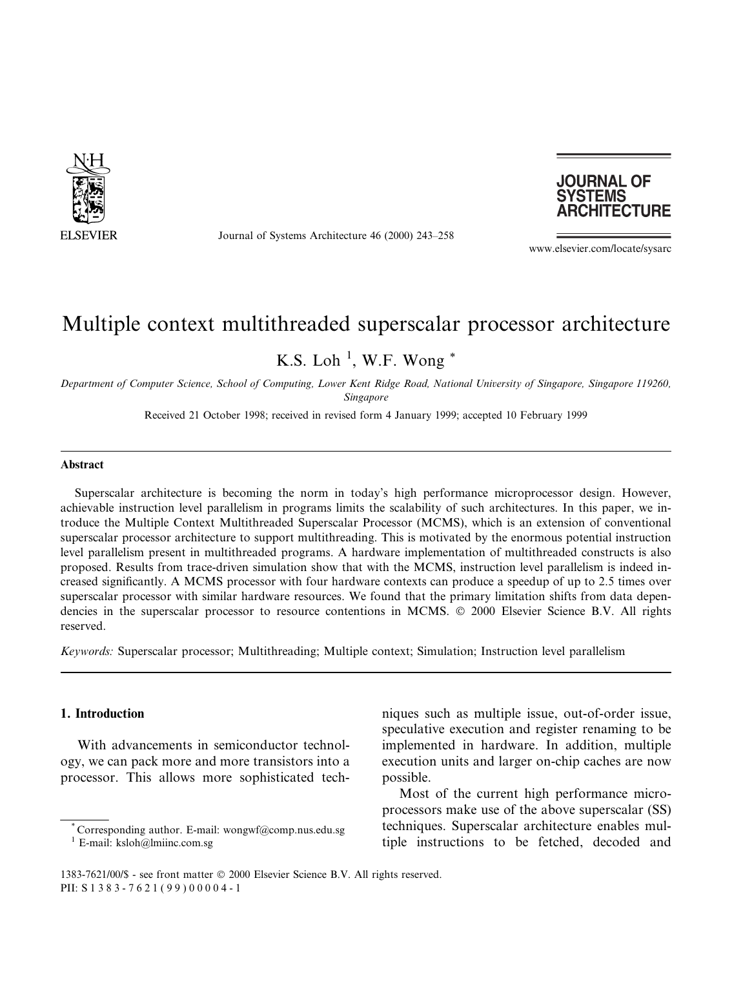
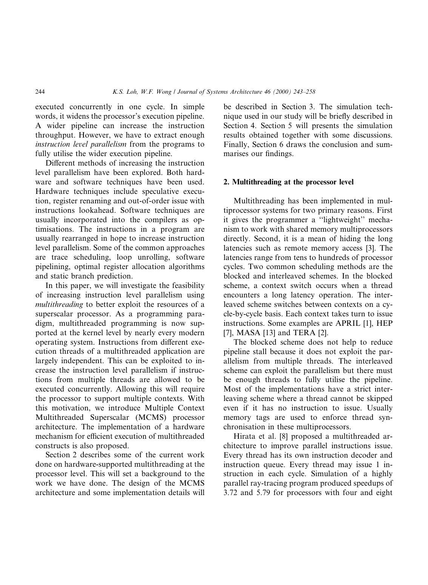
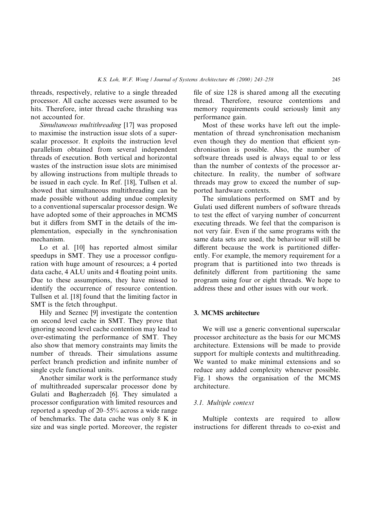

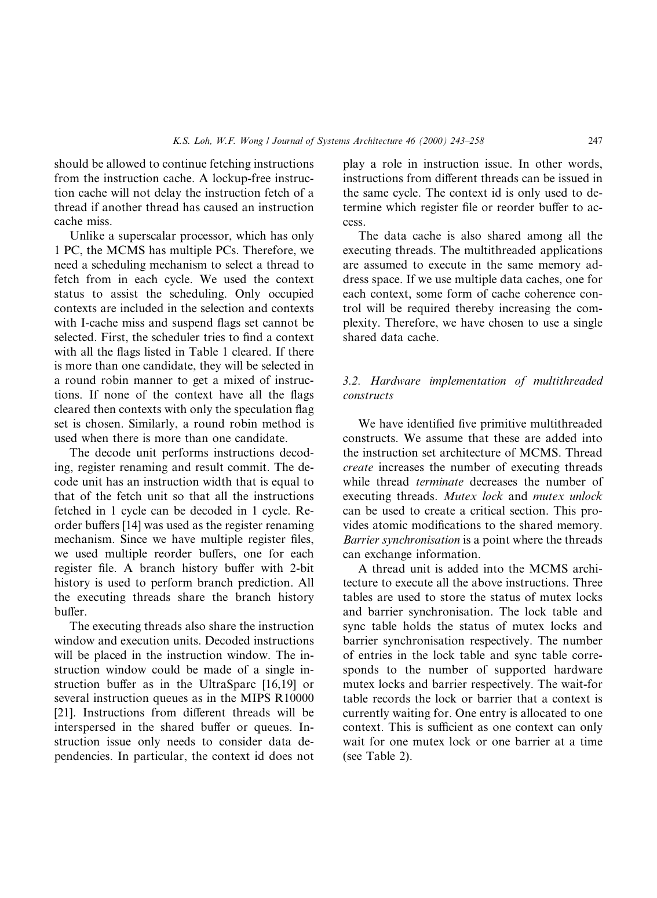

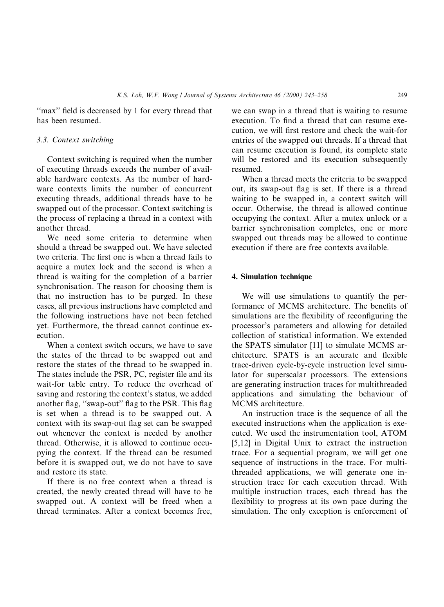
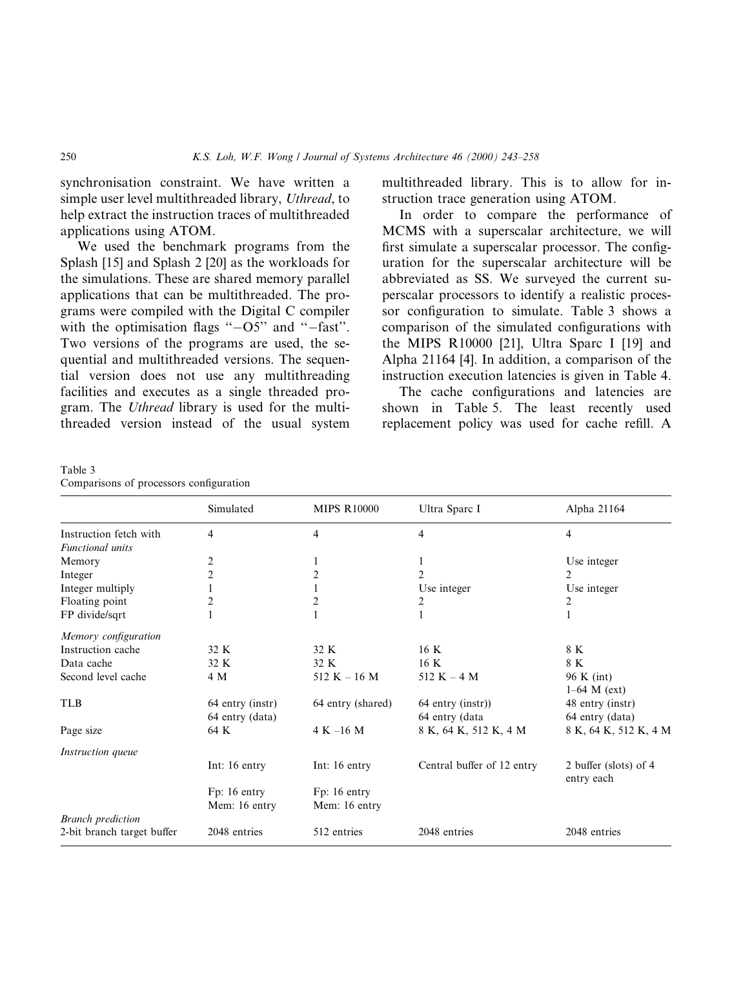
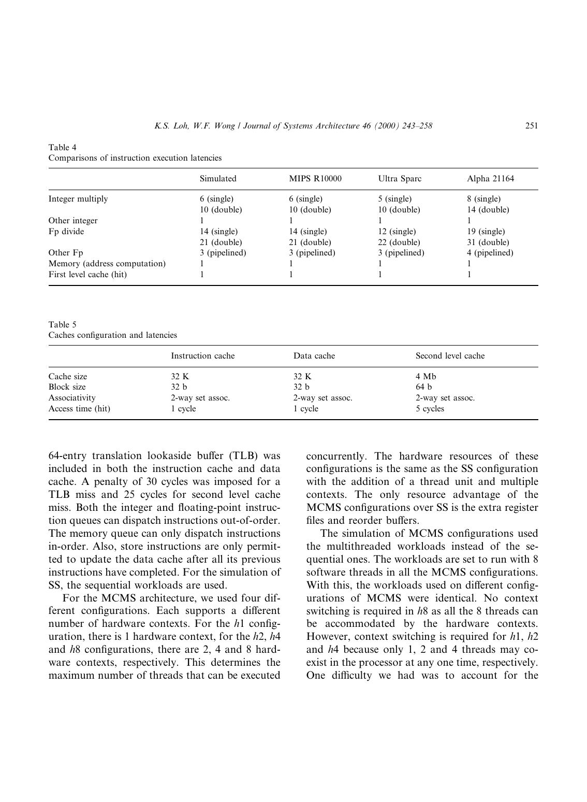
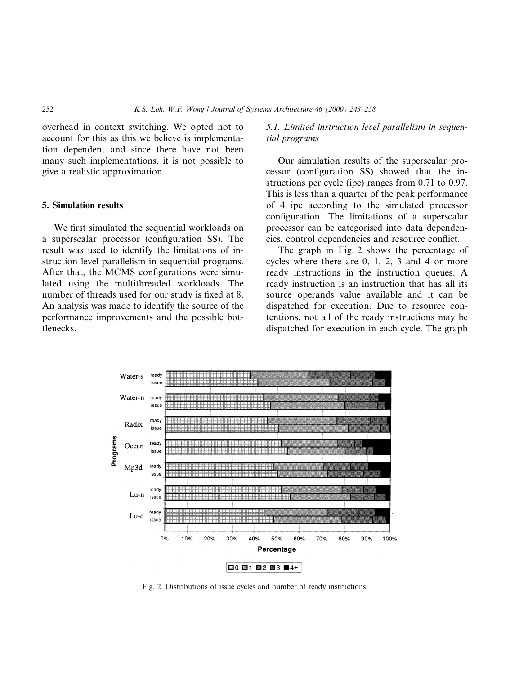
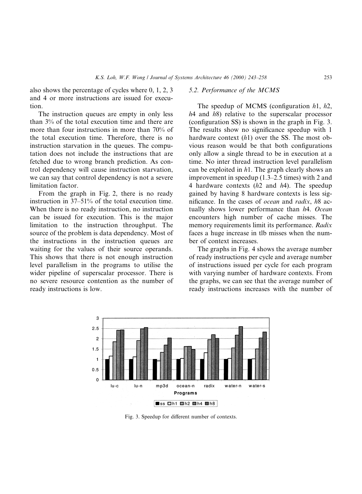

